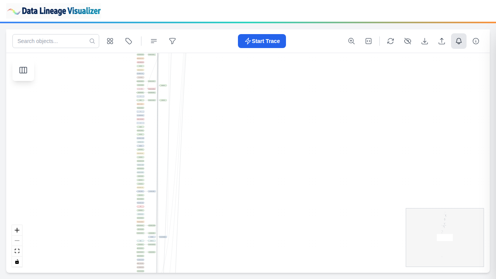
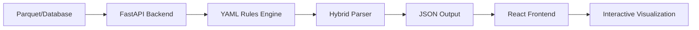

# Data Lineage Visualizer

<div align="center">


**Interactive lineage analysis for SQL data warehouses**

Visualize tables, views, and stored procedures with their dependencies.
Built for data engineers and DBAs working with complex data pipelines.

[Quick Start](#quick-start) • [Features](#features) • [Documentation](#documentation) • [Architecture](docs/ARCHITECTURE.md)



</div>

---

## Why Data Lineage Visualizer?

- ✅ **100% Parse Success Rate** - Pure YAML regex parser never fails
- ⚡ **5-Minute Setup** - One command to install and run
- 🔧 **Customizable** - YAML rules engine, no Python coding required
- 🔌 **Flexible Inputs** - Parquet files OR direct database connection
- 📊 **Rich Visualization** - Interactive graph with trace mode and filtering
- 🚀 **Production Ready** - MIT licensed, tested, documented

---

## Quick Start

```bash
# Install and run (one command)
pip install -r requirements.txt && ./start-app.sh
```

**Access:**
- Frontend: http://localhost:3000
- API: http://localhost:8000/docs

**Next:** Upload Parquet files or [connect to database](docs/DATABASE_CONNECTOR_SPECIFICATION.md)

---

## Features

### Core Capabilities

| Feature | Description |
|---------|-------------|
| **Interactive Graph** | Pan, zoom, and explore with React Flow |
| **Trace Mode** | Analyze upstream/downstream dependencies (BFS traversal) |
| **SQL Viewer** | Monaco Editor with syntax highlighting (VS Code engine) |
| **Smart Filtering** | Schema, type, pattern-based, and focus filtering |
| **Search** | Full-text search across all DDL definitions |

### Data Sources (v0.10.0)

| Method | Use Case | Status |
|--------|----------|--------|
| **Parquet Upload** | Manual metadata file upload | Default |
| **Database Direct** | Auto-refresh from SQL Server/Synapse/Fabric | Optional (v0.10.0) |
| **JSON Output** | Export/import processed lineage | Built-in |

**Database Connection Features:**
- Incremental refresh (hash-based change detection)
- Multi-database support (PostgreSQL, Snowflake, Oracle, BigQuery)
- Azure Key Vault integration for production

### Power User Features (v0.9.0)

| Feature | Description |
|---------|-------------|
| **YAML Rule Engine** | Customize SQL preprocessing (17 built-in rules) |
| **Developer Mode** | Real-time logs viewer + YAML rules browser |
| **Multi-Dialect** | Support for 7 databases (T-SQL, PostgreSQL, Snowflake, etc.) |
| **Reset to Defaults** | Restore factory rules with one click |

---

## Recent Updates (v0.10.1 - 2025-11-23)

### ✅ Rendering Performance Optimizations
- **CSS Module Import** - React Flow stylesheet now imports from module instead of CDN (fixes tracking prevention blocks)
- **Confidence Badge Cleanup** - Removed deprecated UI elements from v4.3.6 cleanup
- **API Diagnostics Logging** - Added timing logs to `/api/latest-data` endpoint for performance monitoring
- **StrictMode Optimization** - Conditional React.StrictMode wrapping (development only)

### 📊 Performance Confirmed
- ✅ Initial page load: **~300-700ms** (API network latency only, not React rendering)
- ✅ Subsequent loads: **<100ms** (cached data)
- ✅ Graph rendering: **1-3ms for 20 nodes** (scales efficiently)
- ✅ **NO automatic database connections** on startup (manual user-triggered only)

### 🧹 Code Quality
- Removed unused confidence badge rendering code
- Simplified memoization strategy
- Added detailed API endpoint logging
- Updated documentation with performance findings

**See:** [BUG_RENDERING_ISSUE.md](BUG_RENDERING_ISSUE.md) for detailed investigation findings

---

## Architecture



**Processing Pipeline:**
1. **Ingest** - Parquet files or database connection → DuckDB
2. **Preprocess** - YAML rules remove dialect-specific syntax
3. **Parse** - YAML regex extraction (100% success, business-user maintainable)
4. **Score** - Confidence calculation (0, 75, 85, 100)
5. **Export** - JSON format for visualization

**Parser Performance (v4.3.3):**
- 100% success rate (349/349 SPs)
- 82.5% perfect confidence (≥90% tables found)
- 2-5 seconds per 100 stored procedures

**See:** [Architecture Details](docs/ARCHITECTURE.md)

---

## Documentation

### Getting Started
- **[QUICKSTART.md](QUICKSTART.md)** - 5-minute setup guide for power users & DBAs
- **[docs/SETUP.md](docs/SETUP.md)** - Detailed installation and configuration
- **[docs/USAGE.md](docs/USAGE.md)** - How to use the application

### Technical Documentation
- **[docs/ARCHITECTURE.md](docs/ARCHITECTURE.md)** - System architecture and data flow
- **[docs/PARSER_TECHNICAL_GUIDE.md](docs/PARSER_TECHNICAL_GUIDE.md)** - Parser internals
- **[engine/rules/README.md](engine/rules/README.md)** - YAML rules system guide

### For DBAs
- **[docs/DATABASE_CONNECTOR_SPECIFICATION.md](docs/DATABASE_CONNECTOR_SPECIFICATION.md)** - Database setup
- **Metadata Contract** - Required DMV queries and schema
- **Connection Examples** - 6 databases with security best practices

### For Developers
- **[CLAUDE.md](CLAUDE.md)** - Development guide (workflows, testing, CI/CD)
- **[.github/workflows/README.md](.github/workflows/README.md)** - CI/CD pipelines
- **[tests/integration/README.md](tests/integration/README.md)** - Integration tests

---

## Tech Stack

### Backend
- **FastAPI** - REST API with async support
- **DuckDB** - In-memory analytics database
- **PyYAML** - For YAML-based extraction rules
- **Python 3.10+** - Application runtime

### Frontend
- **React 19** - UI framework with concurrent rendering
- **React Flow** - Interactive graph visualization
- **Monaco Editor** - SQL syntax highlighting
- **Tailwind CSS** - Utility-first styling

### Parser Engine (v4.3.3)
- **YAML-Based Extraction** - Business users can edit patterns without Python
- **YAML Rules** - Dialect-specific preprocessing
- **Confidence Model** - (found / expected) * 100

---

## Configuration

**Default:** Works out-of-the-box, no `.env` needed for local development.

**Optional Custom Settings:**

```bash
cp .env.example .env
# Edit .env for custom configuration
```

### Key Options

| Variable | Default | Description |
|----------|---------|-------------|
| `SQL_DIALECT` | `tsql` | Target database dialect |
| `RUN_MODE` | `production` | Runtime mode (demo/debug/production) |
| `LOG_LEVEL` | `INFO` | Logging level (DEBUG for details) |
| `DB_ENABLED` | `false` | Enable database direct connection |

**See:** [.env.example](.env.example) for all options

---

## Deployment

### Local
```bash
./start-app.sh  # Auto-detects venv, installs deps
```

### Docker
```bash
docker build -t lineage-viz .
docker run -p 8000:8000 -p 3000:3000 lineage-viz
```

### Azure
```bash
az containerapp up --name lineage-viz --resource-group <rg>
```

**See:** [docs/SETUP.md](docs/SETUP.md) for detailed deployment guides

---

## Testing

```bash
# Unit tests (73 tests)
source venv/bin/activate && pytest tests/unit/ -v

# Integration tests (64 tests)
source venv/bin/activate && pytest tests/integration/ -v

# E2E tests (Playwright)
cd frontend && npm run test:e2e
```

**CI/CD:** Automated testing on every push + PR validation

---

## Performance

| Metric | Value | Notes |
|--------|-------|-------|
| **Parser Success** | 100% (349/349 SPs) | Zero failures |
| **Perfect Confidence** | 82.5% (288 SPs) | ≥90% tables found |
| **Average Confidence** | 95.7 | High accuracy |
| **Processing Speed** | 2-5s per 100 SPs | Fast parsing |
| **Frontend Nodes** | 5,000+ supported | Tested at scale |
| **Graph Rendering** | 40-60ms (500 nodes) | Smooth 15-25 FPS |

---

## License

MIT License - see [LICENSE](LICENSE) file for details.

Copyright (c) 2025 Christian Wagner

---

## Support

- **Issues:** [GitHub Issues](../../issues)
- **Discussions:** [GitHub Discussions](../../discussions)
- **Documentation:** See [docs/](docs/) folder

---

<div align="center">

**Built with [Claude Code](https://claude.com/claude-code)**

⭐ Star this repo if you find it useful!

</div>
