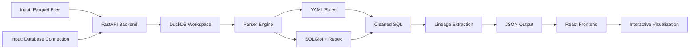
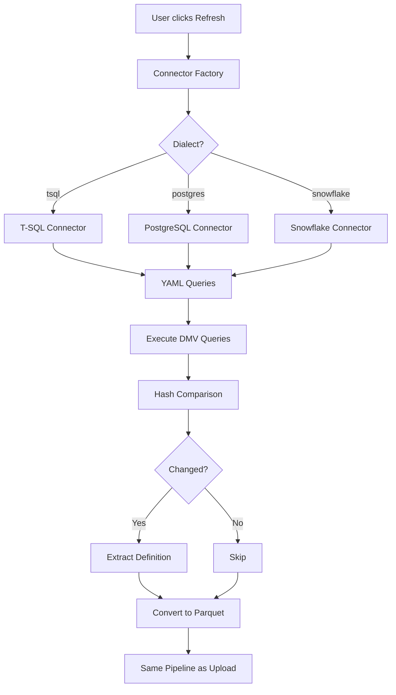

# Architecture Overview

**Data Lineage Visualizer v0.10.0**

## System Flow



## Data Flow

### Input Sources (3 Options)

| Method | Description | Use Case |
|--------|-------------|----------|
| **Parquet Upload** | Upload 3-5 Parquet files from DMV extraction | Default, manual process |
| **Database Direct** | Connect to SQL Server/Synapse/Fabric | Automated refresh (optional, v0.10.0) |
| **API Import** | Load existing JSON via `/api/latest-data` | Restore previous session |

### Processing Pipeline

```
1. Data Ingestion
   ├─ Parquet → DuckDB (automatic schema detection)
   ├─ Database → Parquet → DuckDB (incremental with hash detection)
   └─ Validation (check required columns)

2. SQL Preprocessing (YAML Rule Engine)
   ├─ Load dialect-specific rules from engine/rules/{dialect}/
   ├─ Apply in priority order (10, 15, 20, ...)
   ├─ Remove dialect-specific syntax (GO, DECLARE, BEGIN/END)
   └─ Extract DML statements (SELECT, INSERT, UPDATE, DELETE)

3. Lineage Extraction (Hybrid Parser v4.3.3)
   ├─ Regex Baseline: Full DDL scan (100% coverage)
   ├─ SQLGlot Enhancement: Parse statements (50-80% success)
   ├─ UNION Strategy: Keep all findings from both methods
   └─ Post-Processing: Remove system objects, temp tables

4. Confidence Scoring
   ├─ Calculate: (found_tables / expected_tables) * 100
   ├─ ≥90% = 100 (Perfect)
   ├─ ≥70% = 85 (Good)
   ├─ ≥50% = 75 (Acceptable)
   └─ <50% = 0 (Needs review)

5. JSON Generation
   ├─ Frontend format: Array of node objects
   ├─ Each node: {id, label, type, schema, confidence, sources, targets}
   └─ Saved to: data/latest_frontend_lineage.json
```

### Output Format

**JSON Structure (Frontend):**
```json
[
  {
    "id": 123,
    "label": "spMyProcedure",
    "type": "P",
    "schema": "dbo",
    "confidence": 100,
    "sources": [101, 102],
    "targets": [201]
  }
]
```

**Download:**
```bash
curl http://localhost:8000/api/latest-data > lineage.json
```

## Parser Architecture (v4.3.3)

### Why 100% Success Rate?

**Dual Strategy:**
1. **Regex Baseline** - Pattern-based extraction (always works, 100% coverage)
2. **SQLGlot Enhancement** - AST parsing (bonus tables when successful)
3. **UNION** - Combine both results (keeps all findings)

**Example:**
```sql
-- Stored Procedure with mixed syntax
CREATE PROCEDURE dbo.spExample AS
BEGIN
    -- Regex finds: TableA, TableB
    SELECT * FROM TableA JOIN TableB ON ...

    -- SQLGlot also finds: TableC (from subquery)
    WHERE id IN (SELECT id FROM TableC)
END

-- Result: UNION {TableA, TableB, TableC} = 100% confidence
```

### YAML Rule Engine

**Purpose:** Remove dialect-specific syntax before SQLGlot parsing

**Example Rule:**
```yaml
name: remove_go
description: Remove GO batch separators
dialect: tsql
enabled: true
priority: 10
pattern: '^\s*GO\s*$'
replacement: ''
```

**Flow:**
```
Original SQL → YAML Rules (priority order) → Cleaned SQL → SQLGlot Parser
```

**Location:** `engine/rules/{dialect}/`

**Supported Dialects:** tsql, postgres, snowflake, oracle, bigquery, redshift, fabric

## Frontend Architecture

### Technology Stack

- **React 19** - UI framework
- **React Flow** - Interactive graph visualization
- **Graphology** - Graph data structure (O(1) neighbor lookup)
- **Monaco Editor** - SQL syntax highlighting (VS Code engine)
- **Tailwind CSS** - Utility-first styling

### Performance Optimizations

- **React.memo** - Prevent unnecessary re-renders
- **useMemo** - Memoize expensive graph calculations
- **useCallback** - Stable callback references
- **Debounced Filtering** - 150ms delay for large datasets
- **Set-based Lookups** - O(1) node filtering

### Key Features

| Feature | Implementation |
|---------|----------------|
| **Trace Mode** | BFS graph traversal (upstream/downstream) |
| **Focus Filtering** | Multi-node filtering with ⭐ designation |
| **Isolated Nodes** | Filter nodes with zero edges |
| **Schema Filtering** | Checkbox-based schema selection |
| **SQL Viewer** | Monaco Editor with lazy loading |
| **Search** | Full-text search across all DDL |

## Database Connector (v0.10.0)

### Architecture



### Incremental Refresh

**Hash-Based Change Detection:**
```sql
-- T-SQL example (from engine/connectors/queries/tsql/metadata.yaml)
SELECT
    object_id,
    SCHEMA_NAME(schema_id) AS schema_name,
    name AS procedure_name,
    HASHBYTES('SHA2_256', OBJECT_DEFINITION(object_id)) AS definition_hash
FROM sys.objects
WHERE type = 'P'
```

**Cache Logic:**
1. Fetch current hashes from database
2. Compare with cached hashes (from previous run)
3. Only extract definitions for changed procedures
4. Update cache with new hashes

**Result:** 10-100x faster refresh for large databases

## Security

### Production Deployment

**Connection Strings:**
- **Development:** `.env` file (gitignored)
- **Azure:** Key Vault references
  ```bash
  DB_CONNECTION_STRING=@Microsoft.KeyVault(SecretUri=https://vault.azure.net/secrets/db-conn)
  ```
- **Docker:** Docker secrets mount
  ```yaml
  secrets:
    - db_connection_string
  ```

**Authentication:**
- Azure Container Apps: Easy Auth (platform-level)
- Self-hosted: Reverse proxy with auth (Nginx, Traefik)

### Data Privacy

- No data leaves your infrastructure
- All processing happens locally
- DuckDB workspace is ephemeral (can be deleted)
- JSON output contains only metadata (no sensitive data)

## Deployment Options

### Local Development
```bash
./start-app.sh  # Backend (8000) + Frontend (3000)
```

### Docker
```dockerfile
# Multi-stage build
FROM python:3.10 AS backend
FROM node:18 AS frontend
FROM nginx AS production
```

### Azure Container Apps
```bash
az containerapp up \
  --name lineage-viz \
  --resource-group <rg> \
  --environment <env>
```

## Testing Strategy

### Unit Tests (73 tests)
- Parser golden cases (user-verified)
- YAML rule engine
- Confidence scoring
- API endpoints

### Integration Tests (64 tests)
- Database validation
- SQLGlot performance
- Confidence distribution
- Failure analysis

### E2E Tests (Playwright)
- Smoke tests
- Upload workflow
- Trace mode
- Filter interactions

### CI/CD Workflows
- Parser validation (on parser changes)
- Full CI (on every push)
- PR validation (fast quality checks)

## Monitoring & Observability

### Logging Levels

| Level | Purpose | Output |
|-------|---------|--------|
| **DEBUG** | Per-object parsing details | `[PARSE] dbo.sp: Path=[...] Confidence=100` |
| **INFO** | Application lifecycle | `✅ API ready`, `📁 Processing job...` |
| **WARNING** | Non-critical issues | `⚠️ Low confidence: dbo.sp (75)` |
| **ERROR** | Processing failures | `❌ SQLGlot parse failed` |

### Developer Mode

**Access:** Help (?) → "For Developers" → "Open Developer Panel"

**Tabs:**
1. **Logs** - Last 500 entries with color-coding
2. **YAML Rules** - Browse and inspect all rules

**Useful for:**
- Debugging parse failures
- Understanding rule application
- Monitoring confidence scores

## Performance Metrics

### Parser (v4.3.3)
- **Success Rate:** 100% (349/349 SPs)
- **Perfect Confidence:** 82.5% (288 SPs)
- **Average Confidence:** 95.7
- **Processing Time:** ~2-5 seconds per 100 SPs

### Frontend (v0.9.0)
- **Graph Rendering:** 40-60ms (500 nodes)
- **Frame Rate:** 15-25 FPS (smooth)
- **Supported Nodes:** 5,000+ (tested)
- **Filter Latency:** 150ms debounce

### Database Connector (v0.10.0)
- **Initial Load:** ~30-60 seconds (1000 SPs)
- **Incremental Refresh:** ~5-10 seconds (10-50 changed SPs)
- **Connection Timeout:** 30 seconds (configurable)

---

**Last Updated:** 2025-11-19
**Version:** v0.10.0
