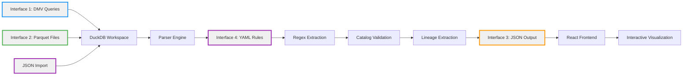

# Architecture Overview

**Data Lineage Visualizer**

> **For Developers:** This system currently supports **Microsoft SQL Server family only** (SQL Server, Azure SQL, Synapse, Fabric). See [CONTRACTS.md](CONTRACTS.md) for the 4 core interface specifications (DMV, Parquet, JSON, YAML).

## System Flow



**Note:** FastAPI Backend and DuckDB are internal implementation details, not external interfaces.

## Data Flow

### Input Sources (3 Options)

| Method | Description | Use Case | Data Source |
|--------|-------------|----------|------------|
| **Parquet Upload** | Upload 3 Parquet files from DMV extraction | Default, manual process, small databases | Pre-exported files (objects, definitions, dependencies) |
| **Database Direct** | Query DMVs live from SQL Server/Azure SQL/Synapse/Fabric | Automated refresh, production databases | **Same data as Parquet**, queried live via DMV methods |
| **JSON Import** | Load existing JSON lineage file | Small databases | Manual import lineage JSON |

**Key Point:** Database Direct import queries the exact same data that Parquet files contain - it's the same data sources, just fetched live instead of pre-exported.

### Processing Pipeline

**Same pattern, same code - only different data sources:**

```
1. Data Ingestion (3 ways to get the same data)
   ├─ Source A: Parquet Upload
   │  ├─ Load 3 Parquet files (objects, definitions, dependencies)
   │  └─ Parse into DuckDB (automatic schema detection)
   │
   ├─ Source B: Database Direct
   │  ├─ Query DMVs: list_procedures, list_tables, list_views, list_functions, list_dependencies
   │  ├─ Convert to Parquet (same schema as uploaded files)
   │  └─ Parse into DuckDB (identical to Source A)
   │
   ├─ Source C: JSON Import
   │  ├─ Load JSON lineage file via GUI
   │  └─ Direct import (skips parsing, uses pre-processed lineage)
   │
   └─ Validation (check required columns)

2. SQL Preprocessing (YAML Rule Engine)
   ├─ Load dialect-specific rules from engine/rules/{dialect}/
   ├─ Apply cleaning rules (remove comments, standardize formatting)
   ├─ Extract DML statements using YAML extraction patterns
   └─ Parse schema.table references with post-processing

3. Lineage Extraction (Pure YAML Regex)
   ├─ Pattern Matching: FROM/JOIN, INSERT/UPDATE/MERGE, EXEC, SELECT INTO
   ├─ Post-Processing: Clean brackets, parse schema.table, handle aliases
   ├─ Catalog Validation: Filter against metadata catalog (removes false positives)
   └─ Result: Only catalog-validated objects included in lineage

4. Diagnostic Reporting
   ├─ Simple counts: expected_tables, found_tables
   ├─ Regex extraction details: sources, targets, sp_calls
   └─ parse_success boolean indicator

5. JSON Output (Interface 3)
   ├─ Frontend format: Array of node objects with string IDs
   ├─ Each node: {id, name, schema, object_type, inputs, outputs, parse_success, ddl_text}
   ├─ Consumed by React frontend
   └─ See INTERFACE_CONTRACTS.md for complete schema
```

### Output Format

**JSON Structure (Frontend):**
```json
[
  {
    "id": "123",
    "name": "spMyProcedure",
    "object_type": "Stored Procedure",
    "schema": "dbo",
    "description": "Parse Success: True",
    "data_model_type": "Other",
    "node_symbol": "diamond",
    "inputs": ["101", "102"],
    "outputs": ["201"],
    "parse_success": true
  }
]
```

**Note:** All IDs are strings. See [CONTRACTS.md](CONTRACTS.md) for complete schema specification.

## Parser Architecture

### Pure YAML Regex Extraction

**Strategy:**
1. **YAML Pattern Matching** - Business-maintainable extraction patterns (100% coverage)
2. **Catalog Validation** - Metadata catalog filters false positives (safety net)
3. **Simple Diagnostics** - Diagnostic counts instead of circular confidence scores

**Example:**
```sql
-- Stored Procedure with standard syntax
CREATE PROCEDURE dbo.spExample AS
BEGIN
    -- Regex finds: dbo.TableA, dbo.TableB
    SELECT * FROM dbo.TableA JOIN dbo.TableB ON ...

    -- Regex finds: dbo.TableC (from subquery)
    WHERE id IN (SELECT id FROM dbo.TableC)

    -- Catalog validation: Only TableA, TableB, TableC exist → All kept
    -- If TableD was incorrectly matched → Filtered out by catalog
END

-- Result: {TableA, TableB, TableC} = parse_success: true
```

### YAML Rule Engine (Interface 4)

**Purpose:** Clean SQL and extract table dependencies using dialect-specific, business-maintainable regex patterns

#### Architecture

The YAML Rule Engine provides **SQL parsing** through a two-phase approach:

1. **Cleaning Phase** - Normalize SQL syntax (remove noise, standardize formatting)
2. **Extraction Phase** - Extract table references using regex patterns

#### Folder Structure

```
engine/rules/
├── defaults/                      # ANSI-compliant rules (all dialects)
│   ├── 05_extract_sources_ansi.yaml
│   ├── 06_extract_targets_ansi.yaml
│   └── 10_comment_removal.yaml
│
├── tsql/                          # T-SQL specific rules
│   ├── 07_extract_sources_tsql_apply.yaml
│   ├── 08_extract_sp_calls_tsql.yaml
│   └── 10_extract_targets_tsql.yaml
```

**Rule Loading Strategy:**
1. Load dialect-specific rules from `engine/rules/{dialect}/`
2. Merge with default ANSI rules from `engine/rules/defaults/`
3. Sort by priority (lower number = higher priority)
4. Apply in order during SQL preprocessing

**Access in UI:** Help (?) → "For Developers" → "Open Developer Panel" → YAML Rules tab


#### Rule Schema

Each YAML file defines a single rule with this structure:

```yaml
name: string                # REQUIRED - Unique identifier
description: string         # REQUIRED - Human-readable purpose
dialect: string             # REQUIRED - Target dialect (tsql)
enabled: boolean            # REQUIRED - Whether rule is active
priority: integer           # REQUIRED - Execution order (lower = earlier, e.g. 10, 20, 30...)
pattern: string             # REQUIRED - Regex pattern to match
replacement: string         # REQUIRED - Replacement string (empty string to remove)

# Optional fields
category: string            # OPTIONAL - Type: cleaning, extraction, normalization (default: 'general')
rule_type: string          # OPTIONAL - For extraction rules: "extraction"
extraction_target: string   # OPTIONAL - For extraction: "source" or "target"
pattern_type: string       # OPTIONAL - Always "regex" (default)
debug:                      # OPTIONAL - Debug logging configuration
  log_matches: boolean
  log_replacements: boolean
  show_context_lines: integer
metadata:                   # OPTIONAL - Documentation only (not used by engine)
  author: string
  created: string
  affects_lineage: boolean
```

**Complete schema:** See `engine/rules/YAML_STRUCTURE.md` and `engine/rules/TEMPLATE.yaml`

#### Example: Cleaning Rule

**File:** `engine/rules/defaults/10_comment_removal.yaml` (actual file)

```yaml
name: remove_comments
description: Remove SQL comments (line and block) before extraction
dialect: generic
category: preprocessing
enabled: true
priority: 1
pattern_type: regex
pattern: >
  (?is)
  (
    --[^\r\n]*       # Line comments
    |
    /\*.*?\*/        # Block comments (multi-line)
  )
replacement: ''
```

**Effect:**
- **Before:** `SELECT * FROM TableA -- Get all records`
- **After:** `SELECT * FROM TableA`
- **Before:** `/* Multi-line comment */ SELECT`
- **After:** `SELECT`

#### Example: Extraction Rule

**File:** `engine/rules/defaults/05_extract_sources_ansi.yaml`

```yaml
name: extract_sources_ansi
description: Extract source table references from ANSI SQL patterns (FROM, JOIN)
dialect: generic
enabled: true
priority: 5
category: extraction
rule_type: extraction
extraction_target: source
pattern_type: regex
pattern: (?i)\b(FROM|JOIN|INNER\s+JOIN|LEFT\s+(?:OUTER\s+)?JOIN|RIGHT\s+(?:OUTER\s+)?JOIN|FULL\s+(?:OUTER\s+)?JOIN|CROSS\s+JOIN|OUTER\s+JOIN)\b\s+([^\s,;()]+)
```

**Effect:**
- **Input:** `SELECT * FROM dbo.TableA JOIN dbo.TableB ON ...`
- **Extracted:** `["dbo.TableA", "dbo.TableB"]` (from regex capture group 2)
- **Post-processing:** Clean brackets, validate against catalog

#### Processing Flow

```
1. Load SQL Definition
   ↓
2. Apply Cleaning Rules (priority 1-49)
   ├─ Remove comments
   ├─ Remove GO separators
   ├─ Standardize whitespace
   └─ Remove SQL hints
   ↓
3. Apply Extraction Rules (priority 50+)
   ├─ Extract FROM/JOIN (sources)
   ├─ Extract INSERT/UPDATE/MERGE (targets)
   ├─ Extract EXEC/EXECUTE (SP calls)
   └─ Extract subqueries
   ↓
4. Post-Processing
   ├─ Remove brackets: [schema].[table] → schema.table
   ├─ Parse schema.table format
   ├─ Handle table aliases
   └─ Filter invalid patterns (e.g., system functions)
   ↓
5. Catalog Validation
   ├─ Check if extracted table exists in metadata catalog
   ├─ Keep only validated tables
   └─ Remove false positives (e.g., variable names, CTEs)
   ↓
6. Lineage Result
   └─ Final {sources, targets} arrays with only catalog-validated objects
```

#### Rule Priority Guidelines

| Priority | Category | Purpose | Examples |
|----------|----------|---------|----------|
| **1** | Preprocessing | Remove syntax that breaks regex | Comments removal |
| **5-6** | ANSI Extraction | Common SQL patterns | FROM, JOIN (5), INSERT, UPDATE (6) |
| **7-8** | Dialect-Specific Extraction | T-SQL specific patterns | APPLY (7), EXEC/SP calls (8) |
| **10** | Additional Rules | Extended cleaning/extraction | Custom dialect rules |

#### Dialect-Specific Features

**T-SQL (SQL Server, Azure SQL, Synapse, Fabric):**
- `APPLY` operator (CROSS APPLY, OUTER APPLY)
- `MERGE` statements
- `OUTPUT` clause
- GO batch separators
- SQL hints (`WITH (NOLOCK)`, `OPTION (RECOMPILE)`)

#### Validation & Error Handling

**JSON Schema Validation:**
- All YAML files validated against JSON schema on load
- Invalid rules logged and skipped (non-blocking)
- See `engine/rules/rule_loader.py` for validation logic

**Error Recovery:**
- Invalid YAML syntax → Skip file, log error, continue
- Missing required fields → Skip rule, log error
- Invalid regex pattern → Skip rule, log error
- Duplicate rule names → Use first occurrence, log warning

**Debugging:**
1. Enable DEBUG logging: `LOG_LEVEL=DEBUG` in `.env`
2. Open Developer Panel: Help (?) → "For Developers"
3. View YAML Rules tab to inspect loaded rules
4. Check logs for rule application details

#### Creating Custom Rules

**Step-by-Step:**

1. **Copy template:**
   ```bash
   cp engine/rules/TEMPLATE.yaml engine/rules/tsql/99_my_custom_rule.yaml
   ```

2. **Edit YAML file:**
   ```yaml
   name: extract_my_pattern
   description: Extract my custom SQL pattern
   dialect: tsql
   enabled: true
   priority: 85
   category: extraction
   rule_type: extraction
   extraction_target: source
   pattern: '\bMY_KEYWORD\s+([^\s,;()]+)'
   ```

3. **Test rule:**
   - Restart application
   - Open Developer Panel → YAML Rules tab
   - Verify rule is loaded and enabled
   - Upload test Parquet file to verify extraction

4. **Add test cases:**
   ```yaml
   examples:
     - before: "SELECT * FROM MY_KEYWORD dbo.MyTable"
       after: "dbo.MyTable"
       description: "Extracts table from MY_KEYWORD syntax"
   ```

**Best Practices:**
- Use descriptive names: `extract_cte_sources`, not `rule5`
- Set appropriate priority (avoid conflicts)
- Test against real SQL before deploying
- Add examples for documentation
- Use capture groups `()` for extraction, not cleaning

#### Implementation Details

**Location:** `engine/rules/`
- **Rule Loader:** `rule_loader.py` (JSON schema validation)
- **Schema Reference:** `YAML_STRUCTURE.md`
- **Template:** `TEMPLATE.yaml`
- **README:** `README.md`

**Available Dialects:**
- ✅ **tsql** - 3 rules (SQL Server, Azure SQL, Synapse, Fabric) - Tested

**Adding New Dialects:** To add support for a new database dialect, implement the `BaseDialect` interface in `engine/dialects/` and create dialect-specific YAML rules in `engine/rules/{dialect}/`. See `engine/dialects/tsql.py` for reference implementations.

## Frontend Architecture

### Technology Stack

- **React 19** - UI framework
- **reactflow** (v11) - Interactive graph visualization library
- **Graphology** - Graph data structure for efficient graph operations
- **@monaco-editor/react** - SQL syntax highlighting (VS Code editor component)
- **Tailwind CSS** - Utility-first CSS framework

### Performance Optimizations

- **React.memo** - Prevent unnecessary re-renders
- **useMemo** - Memoize expensive graph calculations
- **useCallback** - Stable callback references
- **Debounced Filtering** - 150ms delay for large datasets
- **Set-based Lookups** - O(1) node filtering

### Key Features

| Feature | Implementation |
|---------|----------------|
| **Trace Mode** | BFS graph traversal (upstream/downstream) |
| **Focus Filtering** | Multi-node filtering with ⭐ designation |
| **Isolated Nodes** | Filter nodes with zero edges |
| **Schema Filtering** | Checkbox-based schema selection |
| **SQL Viewer** | Monaco Editor with lazy loading |
| **Search** | Full-text search across all DDL |

### Developer Mode

**Access:** Help (?) → "For Developers" → "Open Developer Panel"

**Tabs:**
1. **Logs** - Last 500 entries with color-coding
2. **YAML Rules** - Browse and inspect all rules

**Useful for:**
- Debugging parse failures
- Understanding rule application
- Monitoring diagnostics

**Supported Features (Tested with T-SQL):**
- ✅ All table objects (U - User Tables)
- ✅ All views (V - Views)
- ✅ All stored procedures (P - Stored Procedures)
- ✅ All user-defined functions (FN, TF, IF - Scalar, Table-Valued, Inline)
- ✅ Full DDL source code for all object types
- ✅ Parquet file generation and DuckDB parsing
