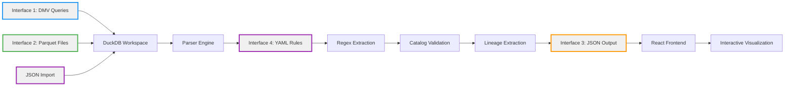

# Architecture Overview

**Data Lineage Visualizer**

> **For Developers:** This system currently supports **Microsoft SQL Server family** (SQL Server, Azure SQL, Synapse, Fabric). Other SQL dialects can be added with generic development effort. See [DATA_SPECIFICATIONS.md](DATA_SPECIFICATIONS.md) for the 4 core interface specifications (DMV, Parquet, JSON, YAML).

## System Flow



**Note:** FastAPI Backend and DuckDB are internal implementation details, not external interfaces.

## Processing Pipeline

### Input Sources (3 Options)

| Method | Description | Use Case | Data Source |
|--------|-------------|----------|------------|
| **Parquet Upload** | Upload 3 Parquet files from DMV extraction | Default, manual process, small databases | Pre-exported files (objects, definitions, dependencies) |
| **Database Direct** | Query DMVs live from SQL Server/Azure SQL/Synapse/Fabric | Automated refresh, production databases | **Same data as Parquet**, queried live via DMV methods |
| **JSON Import** | Load existing JSON lineage file | Small databases | Manual import lineage JSON |

**Key Point:** Database Direct import queries the exact same data that Parquet files contain - it's the same data sources, just fetched live instead of pre-exported.

### Processing Pipeline

**Same pattern, same code - only different data sources:**

```
1. Data Ingestion (3 ways to get the same data)
   ├─ Source A: Parquet Upload
   │  ├─ Load 3 Parquet files (objects, definitions, dependencies)
   │  └─ Parse into DuckDB (automatic schema detection)
   │
   ├─ Source B: Database Direct
   │  ├─ Query DMVs: list_procedures, list_tables, list_views, list_functions, list_dependencies
   │  ├─ Convert to Parquet (same schema as uploaded files)
   │  └─ Parse into DuckDB (identical to Source A)
   │
   ├─ Source C: JSON Import
   │  ├─ Load JSON lineage file via GUI
   │  └─ Direct import (skips parsing, uses pre-processed lineage)
   │
   └─ Validation (check required columns)

2. SQL Preprocessing (YAML Rule Engine)
   ├─ Load dialect-specific rules from engine/rules/{dialect}/
   ├─ Apply cleaning rules (remove comments, standardize formatting)
   ├─ Extract DML statements using YAML extraction patterns
   └─ Parse schema.table references with post-processing

3. Lineage Extraction (Pure YAML Regex)
   ├─ Pattern Matching: FROM/JOIN, INSERT/UPDATE/MERGE, EXEC, SELECT INTO
   ├─ Post-Processing: Clean brackets, parse schema.table, handle aliases
   ├─ Catalog Validation: Filter against metadata catalog (removes false positives)
   └─ Result: Only catalog-validated objects included in lineage

4. Diagnostic Reporting
   ├─ Simple counts: expected_tables, found_tables
   ├─ Regex extraction details: sources, targets, sp_calls
   └─ parse_success boolean indicator

5. JSON Output (Interface 3)
   ├─ Frontend format: Array of node objects with string IDs
   ├─ Each node: {id, name, schema, object_type, inputs, outputs, parse_success, ddl_text}
   ├─ Consumed by React frontend
   └─ See DATA_SPECIFICATIONS.md for complete schema
```

### Output Format

**JSON Structure (Frontend):**
```json
[
  {
    "id": "123",
    "name": "spMyProcedure",
    "object_type": "Stored Procedure",
    "schema": "dbo",
    "description": "Parse Success: True",
    "data_model_type": "Other",
    "node_symbol": "diamond",
    "inputs": ["101", "102"],
    "outputs": ["201"],
    "parse_success": true
  }
]
```

**Note:** All IDs are strings. See [DATA_SPECIFICATIONS.md](DATA_SPECIFICATIONS.md#json-output-format) for complete schema specification.

## Parser Architecture

### Pure YAML Regex Extraction

**Strategy:**
1. **YAML Pattern Matching** - Business-maintainable extraction patterns (100% coverage)
2. **Catalog Validation** - Metadata catalog filters false positives (safety net)
3. **Simple Diagnostics** - Diagnostic counts instead of circular confidence scores

**Example:**
```sql
-- Stored Procedure with standard syntax
CREATE PROCEDURE dbo.spExample AS
BEGIN
    -- Regex finds: dbo.TableA, dbo.TableB
    SELECT * FROM dbo.TableA JOIN dbo.TableB ON ...

    -- Regex finds: dbo.TableC (from subquery)
    WHERE id IN (SELECT id FROM dbo.TableC)

    -- Catalog validation: Only TableA, TableB, TableC exist → All kept
    -- If TableD was incorrectly matched → Filtered out by catalog
END

-- Result: {TableA, TableB, TableC} = parse_success: true
```

### YAML Rule Engine

The YAML Rule Engine uses dialect-specific regex patterns to clean SQL and extract table dependencies through a two-phase process (cleaning → extraction), with rules loaded from `engine/rules/{dialect}/` and merged with ANSI defaults. For creating custom rules, managing configurations, and accessing the Developer Panel, see [DEVELOPMENT.md](DEVELOPMENT.md#yaml-rule-configuration).

## Frontend Architecture

### Technology Stack

- **React 19** - UI framework
- **reactflow** (v11) - Interactive graph visualization library
- **Graphology** - Graph data structure for efficient graph operations
- **@monaco-editor/react** - SQL syntax highlighting (VS Code editor component)
- **Tailwind CSS** - Utility-first CSS framework

### Performance Optimizations

- **React.memo** - Prevent unnecessary re-renders
- **useMemo** - Memoize expensive graph calculations
- **useCallback** - Stable callback references
- **Debounced Filtering** - 150ms delay for large datasets
- **Set-based Lookups** - O(1) node filtering

### Key Features

| Feature | Implementation |
|---------|----------------|
| **Trace Mode** | BFS graph traversal (upstream/downstream) |
| **Focus Filtering** | Multi-node filtering with ⭐ designation |
| **Isolated Nodes** | Filter nodes with zero edges |
| **Schema Filtering** | Checkbox-based schema selection |
| **SQL Viewer** | Monaco Editor with lazy loading |
| **Search** | Full-text search across all DDL |
